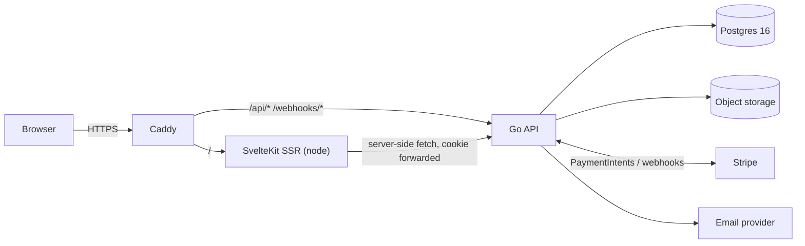

# Architecture

## Principles

1. **Boring technology, deliberately.** Every component is mainstream, documented, and debuggable by one person at 11pm.
2. **Modular monolith.** One Go binary, one SvelteKit app, package-per-domain. Domains are separable later; nothing is separated now.
3. **Postgres for everything** — data, sessions, full-text search, job coordination, chat. Each extra datastore is a tax; none is justified at this scale.
4. **Stateless API.** Any number of Go instances can run behind a load balancer from day one. Scale is a deployment concern, not a rewrite.
5. **Policy is data, not code.** `transfer_policy` lives on the race row; behavior derives from it in one place per layer — never scattered `if` statements.

## Stack

| Layer | Choice | Why |
|---|---|---|
| Frontend | **SvelteKit** (Svelte 5, TypeScript strict), adapter-node | SSR for SEO on race/listing pages (this product lives off search traffic); learning goal; small bundle |
| UI | Hand-rolled components, **scoped Svelte CSS** (design tokens in `layout.css`); forms via **SvelteKit form actions + native HTML5 validation** | Core-primitives learning goal — no CSS framework or form library (D14) |
| i18n | Hand-rolled message dictionaries, no i18n library | en+es only at beta; revisit if locale count grows (D14) |
| Backend | **Go 1.25+**, stdlib `net/http` `ServeMux` (Go 1.22 method + wildcard patterns) | Zero router dependency (D14); Go's concurrency fits chat/webhooks naturally |
| DB access | **sqlc** (compile-time generated, type-safe) + **pgx/v5** pool | Real SQL, zero runtime magic, compiler catches schema drift — no ORM |
| Migrations | **goose** | Plain numbered SQL files, no DSL |
| Database | **PostgreSQL 16** | The default answer; FTS covers search; advisory locks coordinate jobs |
| Object storage | **S3-compatible** — MinIO (dev) → R2 or Scaleway (prod, [Decision 7](https://github.com/leonfullxr/bibseller/issues/3)) | Bib proofs, race images |
| Payments | **Stripe Connect** (Express accounts, separate charges & transfers) | See [PAYMENTS_AND_COMPLIANCE.md](PAYMENTS_AND_COMPLIANCE.md) |
| Email | Interface in `internal/platform/mailer`; **Mailpit** (dev) → provider per [Decision 6](https://github.com/leonfullxr/bibseller/issues/3) | Swappable, testable |
| Background jobs | In-process ticker + **Postgres advisory lock** (single-runner guarantee across instances) | Listing expiry, auto-release, retention. Upgrade path: [River](https://riverqueue.com) (Postgres-native queue) when jobs need retries/visibility |
| Errors/monitoring | **Sentry** (Go + SvelteKit), `slog` JSON logs | One-person ops |
| Web entry | **Caddy** | TLS automation, `/api/*` split, security headers |

**Explicitly absent until proven necessary:** Redis, message queues, Kubernetes, GraphQL, microservices, Elasticsearch. The decision log below records the trigger that would change each "no".

## System shape



Single origin in prod (Caddy routes by path) and in dev (Vite proxies `/api/*` → `:8080`) — **no CORS anywhere**. SvelteKit `load` functions call the Go API server-side, forwarding the session cookie; the browser only calls the API directly for interactive bits (chat polling, form actions).

## Repo layout

```
bibseller/
├── docker-compose.yml          # dev infra only: Postgres + MinIO + Mailpit
├── Makefile                    # dev, migrate, sqlc, seed, test, lint
├── .env.example
├── .github/workflows/ci.yml
├── docs/
├── backend/
│   ├── cmd/api/main.go         # wiring only: config → pool → router → serve
│   ├── internal/               # Go-enforced privacy boundary
│   │   ├── auth/               # sessions, middleware, password hashing
│   │   ├── user/
│   │   ├── race/
│   │   ├── listing/
│   │   ├── chat/
│   │   ├── order/              # the state machine lives here
│   │   ├── payment/            # ALL Stripe code sealed here, incl. webhooks
│   │   └── platform/           # shared: config, db, mailer, storage, jobs, httpx
│   ├── db/
│   │   ├── migrations/         # goose: 0001_users.sql, 0002_races.sql, ...
│   │   └── queries/            # sqlc inputs: race.sql, listing.sql, ...
│   ├── sqlc.yaml
│   └── go.mod
└── frontend/
    ├── src/
    │   ├── lib/
    │   │   ├── api/            # typed client for the Go API
    │   │   ├── components/     # PolicyBadge, DisclaimerBlock, ...
    │   │   └── i18n/           # Paraglide messages
    │   ├── routes/
    │   │   ├── races/[slug]/
    │   │   ├── listings/[id]/
    │   │   ├── sell/
    │   │   └── account/        # listings, inbox, settings
    │   └── hooks.server.ts     # session → locals.user, locale detection
    ├── vite.config.ts          # Vite + SvelteKit config (incl. adapter-node) — no separate svelte.config.js
    └── package.json
```

**Package-by-domain, not package-by-layer.** Everything about orders — handlers, service logic, queries — lives in `internal/order`. The classic `handlers/`–`services/`–`models/` smear (familiar from MVC Python) is exactly what we avoid; a vertical slice lifts out cleanly if it ever needs to.

**`payment/` is a sealed module.** `order` consumes a small interface (`Charge`, `Transfer`, `Refund`); all Stripe SDK calls and webhook handling stay in one directory. The state machine is testable without Stripe, and Stripe API changes have a one-directory blast radius.

## API conventions

- Base path `/api/v1`, resources plural, JSON with `snake_case` keys.
- Errors: `{"error": {"code": "listing_not_available", "message": "...", "field_errors": {...}}}` with accurate HTTP status. Codes are stable strings the frontend switches on.
- Auth: session cookie (below). `401` = not signed in, `403` = signed in but not allowed.
- Pagination: cursor-based — `?cursor=<last-uuidv7>&limit=24` (max 100) → `{"items": [...], "next_cursor": "..."}`. UUIDv7 ids are time-ordered, so the id **is** the cursor.
- Idempotency: `Idempotency-Key` header honored on order/payment POSTs.
- Rate limiting: `429` + `Retry-After`. v1 is per-instance in-memory (`golang.org/x/time/rate`, keyed by IP + route class); central store only when instance count makes it leaky.
- Timestamps: RFC 3339 UTC.
- The API surface is documented in `backend/api/openapi.yaml` (maintained by hand from M2; codegen only if it stops matching reality).

## Auth & sessions

- Passwords: **argon2id** (OWASP parameters), via `alexedwards/argon2id`.
- Sessions: 32-byte random token; **SHA-256 hash** stored in `sessions` (a DB leak leaks no usable tokens); 30-day idle expiry; rotation on login.
- Cookie: `__Host-session` — `HttpOnly`, `Secure`, `SameSite=Lax`, `Path=/`.
- CSRF: `SameSite=Lax` + an Origin/`Sec-Fetch-Site` check middleware on every mutating route. No token dance needed with this combination.
- Email verification gates listing/chat (browsing stays open).
- No auth SaaS: cost zero, EU data stays home, and it's the best possible Go learning project. OAuth (Google/Strava) is post-v1 additive.

## Dev environment

`docker-compose.yml` (repo root) runs **infrastructure only** — Postgres 16, MinIO (S3-compatible), Mailpit (dev email UI on `:8025`) — with healthchecks so `docker compose up -d --wait` blocks until everything is ready. Both apps run natively for hot reload.

Daily loop — `make dev` does all of this, or run pieces by hand:

1. `docker compose up -d --wait`
2. `cd backend && air` — recompiles on save; Go builds fast enough to feel like Python (falls back to `go run ./cmd/api` if air isn't installed)
3. `cd frontend && npm run dev` — Vite proxies `/api/*` → `localhost:8080`
4. When working on payments: `stripe listen --forward-to localhost:8080/webhooks/stripe`

Toolchain (once): Go 1.25+, Node 22+, Docker. Optional: `air`, `golangci-lint`, Stripe CLI (M6+). `goose` and `sqlc` need no install — the Makefile runs **pinned versions** via `go run pkg@version`, deliberately outside `go.mod` (sqlc's dependency tree forces `go`-directive bumps that break linters). Nothing else — no Kubernetes, no Terraform.

`Makefile` targets: `dev`, `migrate`, `migrate-down`, `sqlc`, `seed`, `test`, `lint`.

## Testing & CI

| What | How |
|---|---|
| Domain logic (state machine!) | Pure Go unit tests; payment provider behind an interface |
| Queries/handlers | Integration tests against real Postgres (CI service container) — sqlc means we never mock SQL |
| Frontend | `svelte-check`, ESLint/Prettier, vitest for logic; Playwright smoke flows from M4 |
| CI (GitHub Actions) | backend: vet + golangci-lint + tests · frontend: check + lint + tests · drift check: `sqlc generate` output committed & current |

## Scaling path (the "millions of users" answer)

A marketplace this shape is **read-dominated** (browse races/listings) with seasonal spikes (registration opens, race week). The design keeps every scaling door open; we walk through each only when a metric says so.

| Stage | Fits | Setup |
|---|---|---|
| **0 — Beta** (≤ ~50k MAU) | One Hetzner VM (4 vCPU) | Everything via Docker Compose; Cloudflare in front for static assets/CDN; Postgres tuned + backed up |
| **1 — Growth** (≤ ~1M MAU) | A weekend of ops work | LB → 2× API + 2× web; Postgres on its own machine + pgbouncer + 1 read replica; chat polling → SSE; central rate-limit store if needed; image CDN |
| **2 — Millions MAU** | Real work, same architecture | Partition `messages`/`order_events` by month; FTS → Meilisearch if relevance demands; jobs → River; managed/HA Postgres; API autoscaling |

Grounding math: 2M MAU at marketplace engagement ≈ hundreds of RPS peak on catalog reads — 2–3 Go instances + indexed Postgres + CDN handle that with room. The first real pressure point is **chat polling** (10k concurrent chatters at 3s ≈ 3.3k cheap indexed QPS); the documented trigger to move to SSE/WebSockets is sustained poll QPS > ~2k or p95 > 100ms. The upgrade is transport-only — messages already live in Postgres.

## Security checklist (running)

- [ ] argon2id, session-hash storage, cookie flags, CSRF middleware (M3)
- [ ] AuthZ: ownership checks on every mutation; admin role separated (M4+)
- [ ] Rate limits: auth endpoints (M3), messages (M5), checkout (M6)
- [ ] Uploads: presigned PUT only, content-type allowlist, size cap, random keys, private bucket, EXIF stripped (M4)
- [ ] Stripe webhook signature verification; idempotent event handling (M6)
- [ ] Security headers via Caddy + SvelteKit hooks: CSP, HSTS, frame-deny (M9)
- [ ] No PII in logs (user ids ok, emails never); secrets only via env (always)

## Decision log

| Decision | Choice | Why | Revisit when |
|---|---|---|---|
| Repo strategy | Monorepo | Solo dev; atomic cross-stack changes | A second team exists |
| ORM | None — sqlc | Type-safe real SQL, zero runtime magic | (Unlikely) |
| API style | REST/JSON | Boring, cacheable, Go-idiomatic; no GraphQL/tRPC complexity | A second API consumer with very different needs |
| IDs | UUIDv7, app-generated | Time-sortable (cursor = id), index-friendly, no coordination | — |
| Chat transport | HTTP polling | Zero infra for zero users; schema is transport-agnostic | Poll QPS > ~2k or p95 > 100ms → SSE/WS |
| Jobs | In-process ticker + advisory lock | Zero infra; correct under multiple instances | Jobs need retries/visibility → River |
| Search | Postgres FTS | One datastore | Relevance complaints at scale → Meilisearch |
| Sessions | Own implementation in Postgres | Cost, control, EU data, learning value | — |
| Tool versioning | `go run pkg@version` pinned in Makefile, not `tool` directives | Keeps sqlc/goose's huge trees out of `go.mod`/`go.sum`; their go-version requirements stop dictating ours | golangci-lint reliably supports current Go targets |
| Currency | EUR-only v1 (column exists) | EU launch focus | Demand from SEK/PLN/DKK markets |
| Caching | CDN + HTTP cache headers only | No invalidation complexity | Measured p95 on hot reads |
