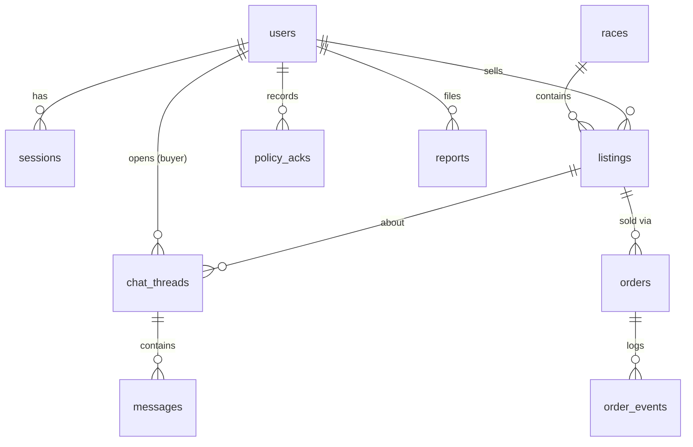
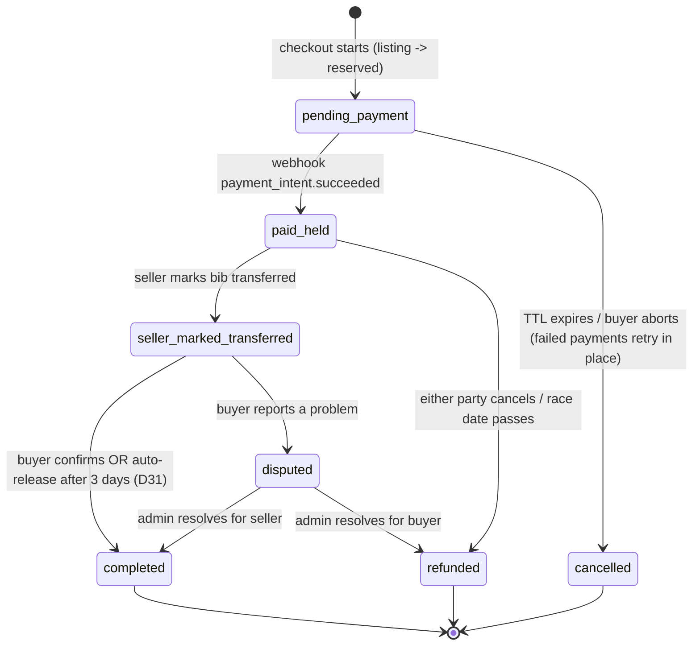

# Data model

Source of truth for the v1 schema ([M1 #2](https://github.com/leonfullxr/bibseller/issues/2)). SQL below is a design sketch - the goose migrations are the executable truth and may refine details, not semantics.

## Conventions

- IDs: UUIDv7, generated app-side (`google/uuid`). Time-ordered -> doubles as pagination cursor.
- Time: `timestamptz` everywhere, UTC. `created_at` (+ `updated_at` where rows mutate).
- Money: integer cents + `currency char(3)`. EUR-only v1; the column exists from day one.
- Enums: `TEXT` + `CHECK` constraint, not Postgres `ENUM` types - adding a value is a one-line constraint swap, not a type migration.
- Deletes: GDPR deletion = anonymization for rows with retention duties (orders), real deletion elsewhere. No generic `deleted_at` soft-deletes.

## ERD



## Tables

### users

```sql
CREATE TABLE users (
    id                 uuid PRIMARY KEY,
    email              citext UNIQUE NOT NULL,
    email_verified_at  timestamptz,
    password_hash      text NOT NULL,
    display_name       text NOT NULL,
    locale             text NOT NULL DEFAULT 'en',
    country            char(2),                          -- ISO 3166-1, needed for DAC7
    created_at         timestamptz NOT NULL DEFAULT now(),
    updated_at         timestamptz NOT NULL DEFAULT now()
);
```

Deferred columns (dropped in 0013 as unused, #124): `role` arrives with the
first admin-gated endpoint, `stripe_account_id`/`stripe_customer_id` with M6
(Stripe Connect), `anonymized_at` with the M7 GDPR delete flow.

### sessions

```sql
CREATE TABLE sessions (
    token_hash  bytea PRIMARY KEY,                        -- SHA-256 of the cookie token
    user_id     uuid NOT NULL REFERENCES users(id) ON DELETE CASCADE,
    created_at  timestamptz NOT NULL DEFAULT now(),
    last_seen_at timestamptz NOT NULL DEFAULT now(),
    expires_at  timestamptz NOT NULL,
    ip          inet,
    user_agent  text
);
CREATE INDEX sessions_user_idx ON sessions (user_id);
```

### races

One row per sellable event (edition × distance): "Berlin Marathon 2026" and "Berlin Half 2026" are separate rows, optionally grouped by `series`. Normalizing into organizers/series tables is a known future step; not needed for v1.

```sql
CREATE TABLE races (
    id                    uuid PRIMARY KEY,
    slug                  text UNIQUE NOT NULL,           -- 'berlin-marathon-2026'
    name                  text NOT NULL,
    series                text,                           -- groups editions/distances
    sport                 text NOT NULL DEFAULT 'running'
        CHECK (sport IN ('running','trail','triathlon','cycling','obstacle','other')),
    distance              text,                           -- 'marathon', '21.1k', '70.3'...
    event_date            date NOT NULL,
    city                  text NOT NULL,
    country               char(2) NOT NULL,
    website_url           text,

    -- the load-bearing field
    transfer_policy       text NOT NULL DEFAULT 'unknown'
        CHECK (transfer_policy IN ('platform_sale','official_only','connect_only','unknown')),
    official_transfer_url text,
    policy_source_url     text,
    policy_notes          text,                           -- quote from race T&C
    policy_verified_at    timestamptz,
    policy_verified_by    uuid REFERENCES users(id),

    status                text NOT NULL DEFAULT 'draft'
        CHECK (status IN ('draft','published','archived')),
    created_by            uuid REFERENCES users(id),
    created_at            timestamptz NOT NULL DEFAULT now(),
    updated_at            timestamptz NOT NULL DEFAULT now(),

    -- policies with legal weight require their evidence
    CHECK (transfer_policy <> 'official_only' OR official_transfer_url IS NOT NULL),
    CHECK (transfer_policy <> 'platform_sale' OR policy_source_url IS NOT NULL)
);
CREATE INDEX races_browse_idx ON races (country, event_date) WHERE status = 'published';
CREATE INDEX races_fts_idx ON races
    USING gin (to_tsvector('simple', name || ' ' || city));
```

Policy semantics (canonical UX matrix in [PRODUCT.md](PRODUCT.md#the-policy-matrix-canonical-ux-definition)):

| | listing | chat | payments | special |
|---|---|---|---|---|
| `platform_sale` | yes | yes | yes | requires `policy_source_url` |
| `official_only` | yes | yes | no | requires `official_transfer_url`, link-out UI |
| `connect_only` | yes | yes after ack | no | strong disclaimer |
| `unknown` (default) | yes | yes after ack | no | = connect_only + "unverified" badge |

### listings

```sql
CREATE TABLE listings (
    id                   uuid PRIMARY KEY,
    race_id              uuid NOT NULL REFERENCES races(id),
    seller_id            uuid NOT NULL REFERENCES users(id),
    status               text NOT NULL DEFAULT 'active'
        CHECK (status IN ('active','reserved','sold','cancelled','expired','removed')),
    price_cents          integer CHECK (price_cents >= 0), -- asking price; informational outside platform_sale
    currency             char(3) NOT NULL DEFAULT 'EUR',
    original_price_cents integer CHECK (original_price_cents >= 0),  -- face value, basis for price cap
    description          text,
    created_at           timestamptz NOT NULL DEFAULT now(),
    updated_at           timestamptz NOT NULL DEFAULT now(),
    expires_at           timestamptz NOT NULL              -- defaults to race event_date
);
CREATE INDEX listings_race_active_idx ON listings (race_id) WHERE status = 'active';
CREATE INDEX listings_seller_idx ON listings (seller_id);
```

Listing lifecycle: `active -> reserved` (checkout holds it) `-> sold` | back to `active` (TTL lapse); `active -> cancelled` (seller) | `expired` (race date job) | `removed` (moderation). Price-cap rule (`price_cents <= original_price_cents` when face value known) per [D2 - decided: hard cap](CONTEXT.md#founder-decisions-log) - enforced in the M4 service layer + tests (cross-row context makes a CHECK awkward).

### chat_threads / messages / policy_acks

```sql
CREATE TABLE chat_threads (
    id                  uuid PRIMARY KEY,
    listing_id          uuid NOT NULL REFERENCES listings(id),
    buyer_id            uuid NOT NULL REFERENCES users(id),
    created_at          timestamptz NOT NULL DEFAULT now(),
    last_message_at     timestamptz,
    buyer_last_read_at  timestamptz,
    seller_last_read_at timestamptz,
    UNIQUE (listing_id, buyer_id)                          -- one thread per buyer per listing
);

CREATE TABLE messages (
    id         uuid PRIMARY KEY,                           -- uuidv7 = the polling cursor
    thread_id  uuid NOT NULL REFERENCES chat_threads(id),
    sender_id  uuid NOT NULL REFERENCES users(id),
    body       text NOT NULL CHECK (char_length(body) BETWEEN 1 AND 4000),
    created_at timestamptz NOT NULL DEFAULT now()
);
CREATE INDEX messages_thread_idx ON messages (thread_id, id);

-- timestamped evidence that the buyer accepted the venue-only terms
CREATE TABLE policy_acks (
    id        uuid PRIMARY KEY,
    user_id   uuid NOT NULL REFERENCES users(id),
    race_id   uuid NOT NULL REFERENCES races(id),
    policy    text NOT NULL,                               -- policy value at ack time
    acked_at  timestamptz NOT NULL DEFAULT now(),
    UNIQUE (user_id, race_id)
);
```

Polling is `SELECT ... WHERE thread_id = $1 AND id > $cursor ORDER BY id LIMIT 100` - covered exactly by `messages_thread_idx`. The seller is implied by `listing.seller_id`; service layer rejects `buyer_id = seller_id` threads and enforces ack-before-first-message in gated modes.

### orders / order_events / stripe_events

Only ever created for `platform_sale` races - enforced in the service layer and by checkout API tests; there is no code path that builds a PaymentIntent from any other policy value.

```sql
CREATE TABLE orders (
    id                       uuid PRIMARY KEY,
    listing_id               uuid NOT NULL REFERENCES listings(id),
    buyer_id                 uuid NOT NULL REFERENCES users(id),
    seller_id                uuid NOT NULL REFERENCES users(id),   -- denormalized for queries
    state                    text NOT NULL DEFAULT 'pending_payment'
        CHECK (state IN ('pending_payment','paid_held','seller_marked_transferred',
                         'completed','disputed','cancelled','refunded')),
    item_amount_cents        integer NOT NULL CHECK (item_amount_cents > 0),
    processing_fee_cents     integer NOT NULL DEFAULT 0,
    total_amount_cents       integer NOT NULL,
    currency                 char(3) NOT NULL DEFAULT 'EUR',
    stripe_payment_intent_id text UNIQUE,
    stripe_transfer_id       text,
    reserved_until           timestamptz,                  -- payment TTL
    seller_marked_at         timestamptz,
    completed_at             timestamptz,
    created_at               timestamptz NOT NULL DEFAULT now(),
    updated_at               timestamptz NOT NULL DEFAULT now()
);
-- at most one live order per listing
CREATE UNIQUE INDEX orders_one_live_per_listing ON orders (listing_id)
    WHERE state IN ('pending_payment','paid_held','seller_marked_transferred','disputed');
CREATE INDEX orders_state_idx ON orders (state);

-- append-only audit trail; every transition writes here in the same transaction
CREATE TABLE order_events (
    id              bigint GENERATED ALWAYS AS IDENTITY PRIMARY KEY,
    order_id        uuid NOT NULL REFERENCES orders(id),
    from_state      text,
    to_state        text NOT NULL,
    actor           text NOT NULL,                         -- 'buyer' | 'seller' | 'system' | 'admin:<id>'
    reason          text,
    stripe_event_id text,
    created_at      timestamptz NOT NULL DEFAULT now()
);

-- webhook idempotency
CREATE TABLE stripe_events (
    id           text PRIMARY KEY,                         -- 'evt_...'
    type         text NOT NULL,
    payload      jsonb NOT NULL,
    processed_at timestamptz NOT NULL DEFAULT now()
);
```

### seller_accounts (M6)

One row per seller who started Stripe Connect onboarding; written by the
`account.updated` Connect webhook, read to gate payment availability
(derived at read time - D34). Lands as an expand migration with M6, together
with `listings.payment_enabled boolean NOT NULL DEFAULT false` (the
per-listing opt-in). Identity/KYC data stays at Stripe.

```sql
CREATE TABLE seller_accounts (
    user_id            uuid PRIMARY KEY REFERENCES users(id),
    stripe_account_id  text NOT NULL UNIQUE,                 -- 'acct_...'
    details_submitted  boolean NOT NULL DEFAULT false,
    transfers_enabled  boolean NOT NULL DEFAULT false,       -- the gate
    disabled_reason    text,                                 -- set while restricted
    created_at         timestamptz NOT NULL DEFAULT now(),
    updated_at         timestamptz NOT NULL DEFAULT now()
);
```

### reports / audit_log

```sql
CREATE TABLE reports (
    id            uuid PRIMARY KEY,
    reporter_id   uuid REFERENCES users(id),               -- nullable: DSA notices can be anonymous
    reporter_email text,                                   -- for non-user notices
    subject_type  text NOT NULL CHECK (subject_type IN ('listing','message','user')),
    subject_id    uuid NOT NULL,
    reason        text NOT NULL CHECK (reason IN ('forbidden_transfer','scam','offensive','other')),
    details       text,
    status        text NOT NULL DEFAULT 'open' CHECK (status IN ('open','actioned','dismissed')),
    created_at    timestamptz NOT NULL DEFAULT now(),
    resolved_at   timestamptz,
    resolved_by   uuid REFERENCES users(id)
);

CREATE TABLE audit_log (
    id           bigint GENERATED ALWAYS AS IDENTITY PRIMARY KEY,
    admin_id     uuid NOT NULL REFERENCES users(id),
    action       text NOT NULL,                            -- 'listing.remove', 'order.refund', ...
    subject_type text NOT NULL,
    subject_id   uuid,
    details      jsonb,
    created_at   timestamptz NOT NULL DEFAULT now()
);
```

## Order state machine



| From | To | Actor | Guard / side effect |
|---|---|---|---|
| - | `pending_payment` | buyer | race is `platform_sale`, seller onboarded, listing `active` -> `reserved`; PaymentIntent created |
| `pending_payment` | `paid_held` | system (webhook) | signature-verified, idempotent via `stripe_events` |
| `pending_payment` | `cancelled` | buyer / system | TTL (30 min) or buyer abort; the job cancels the PaymentIntent at Stripe *before* flipping state (kills the late-success race) -> listing back to `active` |
| `paid_held` | `seller_marked_transferred` | seller | sets `seller_marked_at` |
| `paid_held` | `refunded` | buyer/seller/system | race date passed or mutual cancel -> Stripe Refund of the item amount (processing fee non-refundable - D31) |
| `seller_marked_transferred` | `completed` | buyer / system | buyer confirm or auto-release after 3 days (D31) -> Stripe Transfer to seller, listing -> `sold` |
| `seller_marked_transferred` | `disputed` | buyer | freezes auto-release |
| `disputed` | `completed` / `refunded` | admin | manual; `audit_log` + `order_events` |

Invariants

1. Transitions happen only in `internal/order`, as `UPDATE orders SET state = $to WHERE id = $1 AND state = $from` - a zero-rowcount update means a concurrent transition won; retry or fail, never overwrite.
2. Every transition appends an `order_events` row in the same transaction.
3. Terminal states (`completed`, `cancelled`, `refunded`) are frozen.
4. Money side effects (Transfer, Refund) execute behind the `payment` interface after the state row commits, always with a deterministic Stripe idempotency key (`transfer:{order_id}`, `refund:{order_id}`) and `metadata.order_id`; a reconciler batchjob backstops every crash window (D32 - [PAYMENTS_AND_COMPLIANCE.md](PAYMENTS_AND_COMPLIANCE.md#idempotency--failure-handling-m6-design)).

## Retention (GDPR minimization)

| Data | Keep | Why / mechanism |
|---|---|---|
| sessions | expiry + 30 d | cleanup job |
| messages | 12 months after race `event_date` | chat is transactional, not an archive; job-deleted |
| policy_acks | 6 years | liability evidence (legitimate interest) - confirm with counsel |
| orders / order_events | 10 years, PII anonymized on account deletion | financial record-keeping (member-state commercial law) - confirm with counsel |
| reports | 3 years | DSA traceability |
| audit_log | 6 years | accountability |
| account deletion | anonymize `users` row (email/name/hash scrubbed), real-delete sessions, messages become "deleted user" | [M7 #11](https://github.com/leonfullxr/bibseller/issues/11) |
