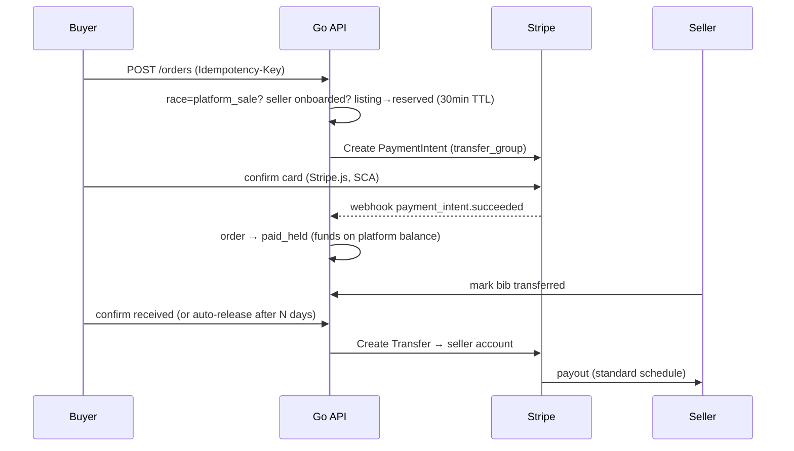

# Payments & EU compliance

## Principles

1. **Zero commission.** The platform earns nothing on any transaction. Payment-processor fees are passed through to the buyer at cost, itemized at checkout (decided — [D1](CONTEXT.md#founder-decisions-log)).
2. **Payments are optional and narrow.** They exist only for `platform_sale` races, only when the seller has completed Stripe onboarding, and only if the pair chooses them. Every other mode is chat-only — the platform never touches money there, structurally.
3. **Held funds, not "escrow".** We use Stripe Connect with delayed transfers — buyer's money sits on the platform account until the bib transfer is confirmed. We avoid the word *escrow* in legal copy: regulated term, different thing.

## Money flow (Stripe Connect, separate charges & transfers)

**Why separate charges & transfers** (vs destination charges): full control of *when* the seller is paid (after confirmation), trivial refunds while funds are still on the platform balance, and the buyer charge is decoupled from the seller's account state. Both sides are EU, so the same-region constraint is satisfied.

- Sellers onboard as **Connect Express** accounts (Account Links) with the `transfers` capability. Stripe runs KYC — we never hold identity documents, only the account id and its status (from `account.updated` webhooks).
- Buyers pay a **PaymentIntent on the platform account** (with a `transfer_group`); Stripe.js collects the card, SCA/3DS happens automatically.



Failure paths: TTL/abort → order `cancelled`, listing back to `active`. Problems before release → `refunded` (full Stripe Refund — easy, funds never left the platform). Buyer dispute after seller marks transferred → `disputed`, manual resolution. Chargebacks while funds are held are low-risk (nothing to claw back from the seller); post-release chargebacks → transfer reversal attempt + ToS clause. Full state machine: [DATA_MODEL.md](DATA_MODEL.md#order-state-machine).

## Fee reality & pass-through

Stripe is not free even when we are: EU consumer cards run ≈ **1.5% + €0.25** per charge, plus Connect payout-leg fees (≈ 0.25% + €0.10 per payout) and a possible per-active-account fee — *verify current pricing at implementation time; treat all rates as config constants.*

With pass-through ON (decided — D1), the buyer sees an itemized "payment processing" line and the gross-up formula keeps the platform at net ≈ €0:

```
total = (item_price + fixed_fees) / (1 − percentage_fees)
```

Example at 1.5% + €0.25: €50.00 bib → buyer pays **€51.02**, seller receives **€50.00**, platform nets ~€0 (± cents; payout-leg fees either folded into the formula or absorbed — [Decisions 1 & 4](https://github.com/leonfullxr/bibseller/issues/3)). Note: Stripe does **not** return the original processing fee on refunds; Decision 4 covers who eats it (recommendation: the platform, at beta volumes).

PCI: Stripe.js/Elements only — card data never touches our servers (SAQ-A). Webhooks: signature-verified, idempotent via the `stripe_events` table, replay-safe.

## Liability posture by policy mode

| | `platform_sale` | `official_only` | `connect_only` / `unknown` |
|---|---|---|---|
| Platform role | Facilitates payment, holds funds | Venue only — transfer happens via the race's own process | Venue only |
| Money through us | ✅ | ❌ never | ❌ never |
| Evidence trail | Full `order_events` log | Link-out UI to official procedure | **Recorded buyer acknowledgment** (`policy_acks`) before first contact |
| Required source | `policy_source_url` (DB-enforced) | `official_transfer_url` (DB-enforced) | — |

This is the strongest structural defense available: for races that restrict transfers, the platform can demonstrate it *cannot* process a payment (no code path), warned both parties, and recorded their acknowledgment. ToS must still state the responsibility split explicitly ([M7 #11](https://github.com/leonfullxr/bibseller/issues/11)).

## GDPR

- **Roles:** we are the controller; processors include hosting, email provider, object storage (DPAs required — keep a list). Stripe acts as an independent controller for its KYC/fraud processing.
- **Lawful bases:** contract (accounts, listings, chat, orders), legal obligation (financial records), legitimate interest (policy acks, abuse prevention, audit log).
- **Data minimization:** no tracking cookies (session cookie only → **no consent banner**), no analytics with PII in v1, no PII in logs, retention schedule enforced by jobs ([DATA_MODEL.md → Retention](DATA_MODEL.md#retention-gdpr-minimization)).
- **Rights:** export (JSON) and delete (anonymization with documented carve-outs for financial records) — both shipped in [M7 #11](https://github.com/leonfullxr/bibseller/issues/11).
- **Residency:** EU hosting (Hetzner Falkenstein recommended); storage/email providers chosen with EU regions or SCCs ([Decisions 6 & 7](https://github.com/leonfullxr/bibseller/issues/3)).
- Records of processing: one honest markdown doc, updated as features land. Breach process: note who to notify and the 72h clock.

## DSA (Digital Services Act)

We are a hosting service / online platform. Micro-enterprise status (<50 staff, <€10M) exempts us from the heavier platform-tier obligations (transparency reports, internal complaint systems at scale), **but hosting-tier duties still apply**:

- **Notice-and-action:** anyone (including non-users) can report a listing/message; reports land in a moderation queue; action is taken and logged.
- **Statement of reasons:** content removal notifies the author with the reason (template + `audit_log` row).
- **Single point of contact** published (contact/imprint page).
- **Clear ToS**, including the per-policy-mode responsibility split and a repeat-infringer policy.
- **Trader traceability (Art. 30):** v1 sellers are consumers (C2C), so trader KYB duties shouldn't bite — but define a threshold (e.g., a seller with many listings/year) at which we re-evaluate. Flag for counsel.

## DAC7 (platform tax reporting)

DAC7 obligations attach to **facilitating** relevant sales — not to profiting from them. Zero commission does not exempt us. Once payments GA, the platform likely qualifies as a reporting platform operator for sellers above the de-minimis threshold (≥30 sales **or** ≥ €2,000/year per seller — below that, sellers are excluded).

- We already capture what reporting needs: seller country (`users.country`), per-seller yearly totals (via `orders`).
- **Action (gates payments GA):** confirm scope + registration with a tax advisor. Most beta sellers will sell 1–2 bibs/year, far under threshold — but the obligation assessment must be done, not assumed. Tracked in [M7 #11](https://github.com/leonfullxr/bibseller/issues/11).

## Compliance gates

| Gate | Must be true |
|---|---|
| **Public beta** (chat-only) | ToS + Privacy published · contact point page · report flow works · GDPR export/delete shipped · EU hosting |
| **Payments GA** | Everything above · Stripe flows + webhooks battle-tested in sandbox · refund/dispute runbook · DAC7 memo signed off · counsel has reviewed ToS responsibility split & disclaimers |
