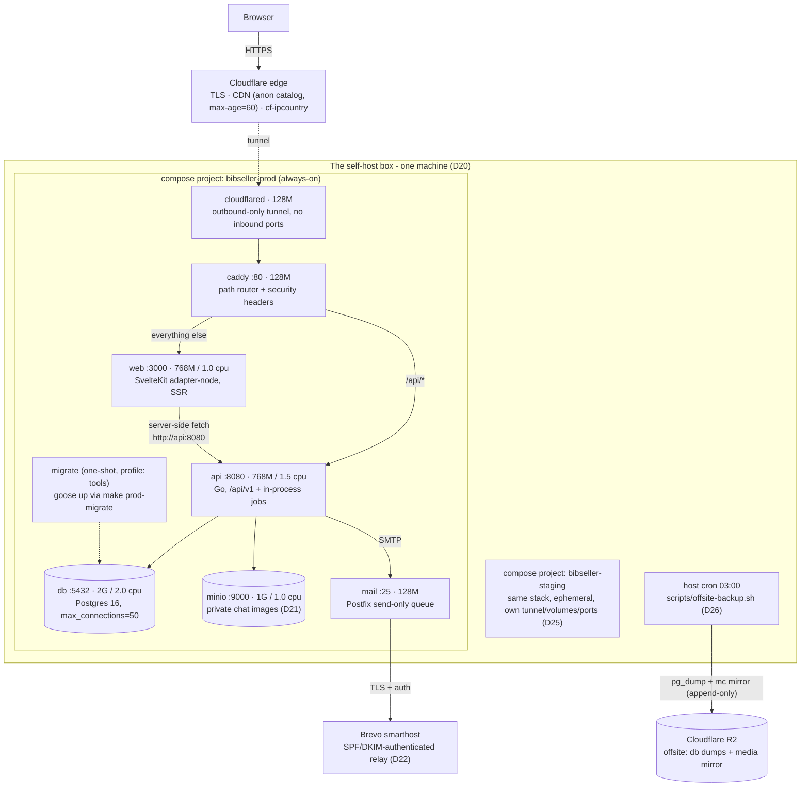
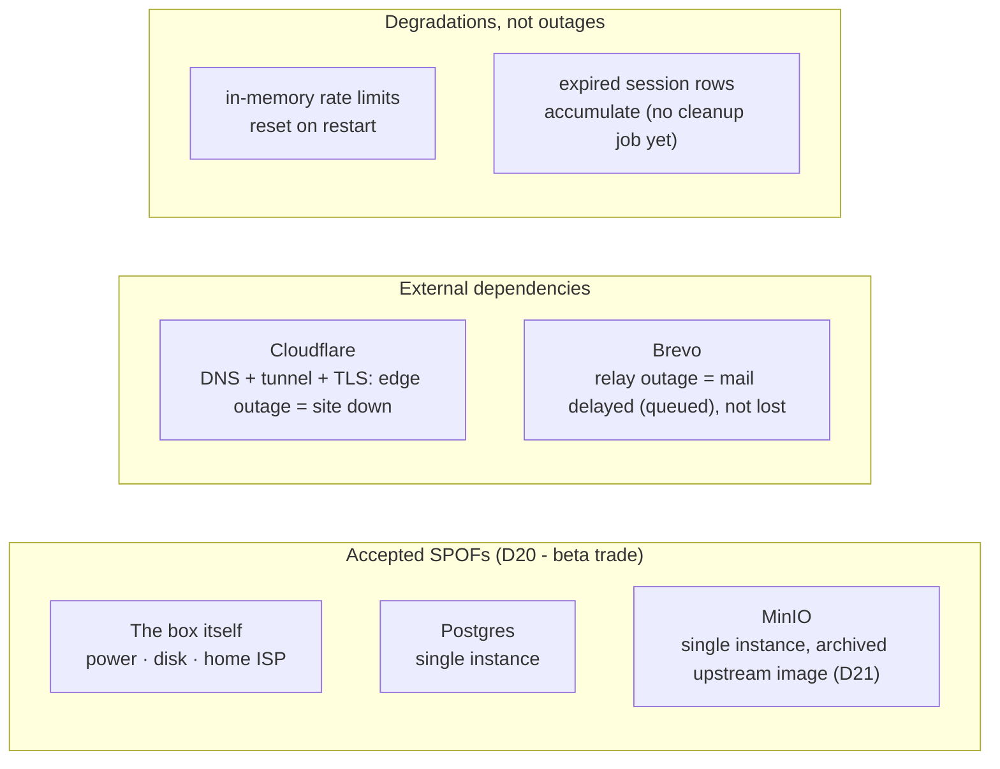
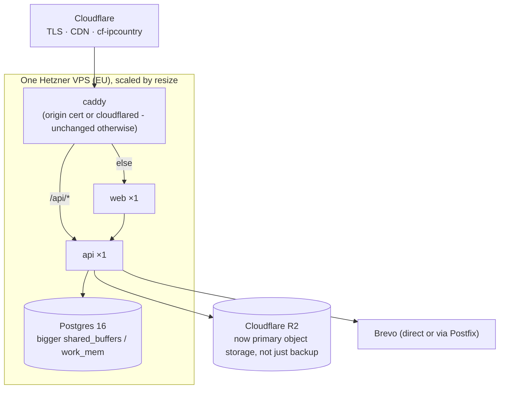
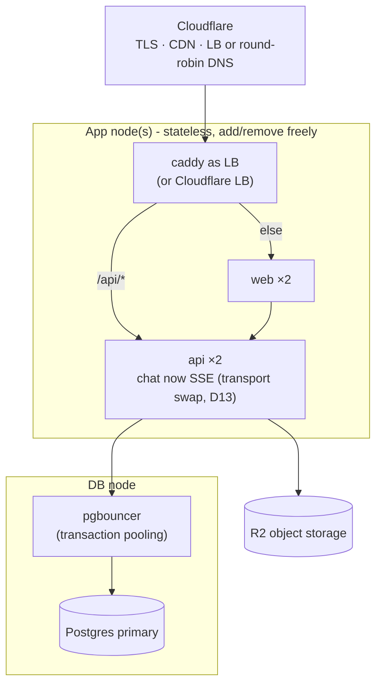
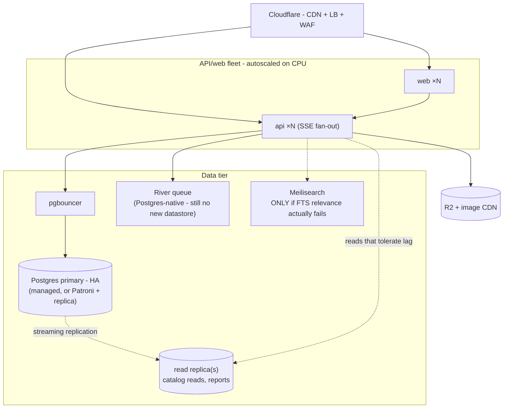

# Structure, resilience & scaling

The as-built system in detail: what runs where, how a request flows, what
breaks when something fails, and the staged model for growing it - vertically
first, then horizontally - without rewriting anything.

Read together with [ARCHITECTURE.md](ARCHITECTURE.md) (principles, stack,
conventions), [DEPLOYMENT.md](DEPLOYMENT.md) (how to run it),
[DATA_MODEL.md](DATA_MODEL.md) (schema) and [CONTEXT.md](CONTEXT.md) (binding
decisions - `D#` references below point there). Where those docs state intent,
this one states what is actually built as of 2026-07 (beta live per D20, M6
payments not yet built) and judges it.

The one-line verdict up front: **the architecture is scalable by design and
capacity-limited by choice.** Every scaling door is held open by invariants
that already exist in code (stateless API, Postgres-coordinated jobs,
transport-agnostic chat, S3-compatible storage); what bounds the system today
is one self-hosted box, and that is a deliberate, documented trade (D8, D20)
with triggers - not an architectural debt.

## The as-built runtime (Stage 0: self-host beta)

Everything below is `deploy/compose.prod.yml` + `deploy/Caddyfile`, driven by
`make prod-*`. Staging is the identical stack as a second compose project on
the same box (D25).



Notes that the diagram can't carry:

- **No published ports** except Postgres on `127.0.0.1:5432` (for
  `make prod-migrate` / backups from the host). Caddy is reachable only through
  the tunnel; the box needs no open inbound firewall ports at all.
- **Resource limits are load-bearing, not decoration** (#94): they exist so the
  staging stack can run on the same box without an OOM taking down prod's
  Postgres. Per-stack steady state ≈ 4.9G; the box budget assumes ~16G.
- **The web image is origin-specific** (D24): `PUBLIC_ORIGIN` is baked at build
  time so asset URLs are absolute. Changing the domain means rebuilding the
  image - and (post-#120) opening the site via any non-canonical origin gives a
  blank page by design (CSP blocks cross-origin assets).
- **The one-shot is transient**: `migrate` runs only via `make prod-migrate`
  (a compose profile keeps it out of `up`). The api creates the MinIO bucket
  itself on boot (EnsureBucket), so no init container exists (#127).

### Service inventory

| Service | Image / build | Role | Limits | State it owns |
|---|---|---|---|---|
| `db` | `postgres:16` | System of record: all domain data, sessions, FTS, job coordination | 2G / 2.0 cpu | `pgdata` volume |
| `minio` | `minio/minio` (pinned, D21) | Private chat images, S3 API | 1G / 1.0 cpu | `miniodata` volume |
| `api` | `backend/Dockerfile` | REST `/api/v1`, policy gating, auth, background jobs | 768M / 1.5 cpu | none (stateless) |
| `web` | `frontend/Dockerfile` | SvelteKit SSR + static assets | 768M / 1.0 cpu | none (stateless) |
| `caddy` | `caddy:2-alpine` | Path routing (`/api/*` vs rest), security headers | 128M / 0.5 cpu | none |
| `mail` | `boky/postfix` | Send-only SMTP queue → Brevo | 128M / 0.25 cpu | mail queue (in-container - see gaps) |
| `cloudflared` | Cloudflare tunnel | Outbound-only ingress | 128M | none |
| `migrate` | `golang:1.25-alpine` (one-shot) | goose migrations | 1G / 2.0 cpu (transient) | none |

Only two services own state. Everything horizontal-scaling cares about is
already concentrated in `db` and `minio` - that is the single most important
structural fact in this document.

## Request flows

```mermaid
sequenceDiagram
    participant B as Browser
    participant CF as Cloudflare
    participant C as caddy
    participant W as web (SSR)
    participant A as api (Go)
    participant P as Postgres

    Note over B,P: 1 · Page view (SSR)
    B->>CF: GET /races
    CF->>C: via tunnel (+ cf-ipcountry)
    C->>W: not /api/* → web:3000
    W->>A: load() fetch http://api:8080/api/v1/races (session cookie forwarded)
    A->>P: sqlc query through pgx pool (MaxConns=20)
    P-->>A: rows
    A-->>W: JSON (snake_case, error envelope on failure)
    W-->>B: HTML + per-request CSP nonce (#120)
    Note over CF,B: anonymous → Cache-Control public,max-age=60 (CDN caches)<br/>signed-in → private,no-store (never shared-cached)

    Note over B,P: 2 · Interactive call (chat polling, forms)
    B->>CF: GET /api/v1/... ?cursor=<last uuidv7>
    CF->>C: via tunnel
    C->>A: /api/* → api:8080
    A->>P: WHERE thread_id=$1 AND id>$cursor (covered by messages_thread_idx)
    A-->>B: new messages; client polls every few seconds (D13)

    Note over B,P: 3 · Private image (server-proxied, D15/D16)
    B->>A: GET /api/v1/... image route (via CF+caddy)
    A->>P: authorize: is requester a thread participant?
    A->>A: fetch object from minio, stream to client
```

Three properties fall out of this shape:

- **Same-origin everywhere, no CORS.** The browser only ever uses relative
  `/api/*` URLs; dev (Vite proxy), staging and prod (Caddy) all preserve this.
  A load balancer later changes nothing for the client.
- **The cache split is the scaling valve for reads.** Anonymous catalog pages
  are CDN-cacheable at the edge; only signed-in and interactive traffic reaches
  the box. Browse-heavy spikes (registration opens, race week) are largely
  absorbed by Cloudflare before they exist.
- **Images cost an API hop by design.** Authorization by thread participation
  requires proxying (D15/D16) - private images can never move to naked CDN
  URLs, and that's the accepted trade for not leaking personal data.

## Software structure (as built)

### Backend: package-by-domain

```
backend/
├── cmd/api/main.go        wiring only: config → pool → router → jobs → serve
├── cmd/seed/main.go       dev-only wipe + load (20 races, all 4 policy modes)
├── internal/
│   ├── auth/              sessions (hashed tokens in PG), argon2id, CSRF check,
│   │                      email verification, password reset/change,
│   │                      per-IP fixed-window rate limit (in-process)
│   ├── user/              account settings (display name, locale, country)
│   ├── race/              catalog: browse, detail, Postgres FTS
│   ├── listing/           CRUD, price-cap rule (D2), past-race expiry job
│   ├── chat/              threads, cursor polling, ack gate, private images,
│   │                      per-account + per-IP write limits, retention job
│   ├── moderation/        reports, blocks
│   ├── order/             (M6, not yet built) the order state machine
│   ├── payment/           (M6, not yet built) ALL Stripe code, sealed
│   └── platform/          config · db (pool/sqlcgen/testdb) · email · httpx
│                          (router, middleware, error envelope, healthz/readyz)
│                          · ids (UUIDv7) · storage (minio-go)
└── db/
    ├── migrations/        goose, forward-only (0001…0011)
    └── queries/           sqlc inputs, one file per domain + jobs.sql
```

Vertical slices: everything about a domain - handlers, service logic, queries -
lives in its one package, so a slice lifts out cleanly if it ever must (it
hasn't had to). `platform/` is the only shared layer, and it is infrastructure,
not domain logic.

**Background jobs** are goroutines started in `main.go`, one ticker per job
(listing expiry hourly, chat retention daily). Each tick takes a
transaction-scoped Postgres advisory lock with a job-distinct key
(`pg_try_advisory_xact_lock`), so any number of API instances can run the same
tickers while exactly one does the work - the single-runner guarantee is in the
database, not in deployment topology. Work is batched (#99/#113) so a large
backlog never becomes one unbounded transaction or object-delete loop.

**Policy gating is layered, never UI-only** (invariant 7): the DB constrains
`transfer_policy` values and requires evidence URLs per policy (CHECK
constraints in `races`); the service layer gates each behavior (chat ack
requirement, listing rules, later checkout); the frontend's `$lib/policy.ts`
derives presentation only.

### Frontend: SvelteKit, thin by intent

```
frontend/src/
├── hooks.server.ts        session cookie → locals.user; locale resolution (D17/D18)
├── lib/
│   ├── api/               server.ts (SSR client, forwards cookie to api:8080),
│   │                      types, stable-error-code mapping, url helpers
│   ├── policy.ts          THE policy view: transfer_policy → CTA/disclaimer/badge
│   ├── chatPoll.ts        cursor polling loop
│   ├── i18n/              hand-rolled dictionaries, en root + /es prefix (D17)
│   ├── geo/               build-time SVG map data (no tile server)
│   ├── server/            session forwarding helpers
│   └── components/        PolicyBadge, DisclaimerBlock, RaceMap, …
└── routes/                races/[slug] · listings/[id] · sell · account/{listings,inbox}
                           · login/register/verify/reset · settings · (legal) · locale
```

Server `load` functions call the Go API and render; the browser then talks to
`/api/*` directly for the interactive parts. The web tier holds no state and
no business rules - it is a renderer plus a poller, which is exactly what makes
it trivially replicable later.

### Data layer

Postgres is deliberately the only datastore (principle 3): domain data,
sessions, full-text search, job coordination and - later - the order audit
trail all live there. sqlc generates typed query code (drift CI-checked); goose
migrations are forward-only and rehearsed against a prod dump on staging before
risky deploys (DEPLOYMENT.md). Schema-level invariants (policy enums, evidence
URLs, money as integer cents) are tested directly in
`platform/db/schema_test.go`.

## Resilience assessment

### What already holds up (and why it was built that way)

| Property | Mechanism | Where |
|---|---|---|
| API instances are disposable | No in-process state that matters; sessions in PG; jobs coordinate via advisory locks | invariant 5, `jobs.sql` |
| Concurrent writes can't corrupt state | Guarded updates (`… WHERE state = $from`), zero-rowcount = lost race, retry/fail | DATA_MODEL invariants |
| Bad data can't enter | CHECK constraints on the load-bearing rules, tested | invariant 2 |
| Boot order doesn't matter | Lazy pgx pool; `/api/readyz` reports truth; bucket-ensure is best-effort with the image routes failing until storage returns | `cmd/api/main.go` |
| Deploys don't drop requests | SIGTERM → graceful `Shutdown` with 10s drain; server read/write timeouts bound slowloris | `cmd/api/main.go` |
| A crash-looping service can't fill the disk | `restart: unless-stopped` + bounded json-file logs (30 MiB/service, #119) | `compose.prod.yml` |
| Staging can't hurt prod | Separate compose project, volumes, tunnel, DB port; hard memory/CPU limits per service (#94) | DEPLOYMENT.md |
| Email survives blips | Postfix queues locally and retries; relay is authenticated (D22) | `mail` service |
| Auth endpoints resist brute force | argon2id + per-IP fixed-window limits; chat writes per-account capped | `auth/ratelimit.go`, `chat/ratelimit.go` |
| Data survives the box dying | Nightly `pg_dump` + append-only media mirror to R2; failure alerts bypass the stack; **monthly rehearsed restore** (D26) | `scripts/` |

The last row is the one that matters most: on a single box, resilience *is*
the backup discipline. An append-only mirror (a MinIO wipe cannot propagate)
plus a drill that proves restore time monthly is a stronger posture than most
single-node setups ever reach.

### Single points of failure, honestly



| Failure | Blast radius | Recovery | Verdict |
|---|---|---|---|
| Box dies (disk, power, theft) | Total outage; data loss bounded by last nightly backup | Restore drill script on any machine + repoint tunnel: **RPO ≤ 24h, RTO ≈ hours** | Accepted for beta (D20); Model B removes the worst of it |
| Postgres down | Everything stops (by design - it's the only datastore) | `restart: unless-stopped`; volume persists | Accepted; HA Postgres is a Stage 2 concern |
| MinIO down | Chat images error; everything else works (bucket-ensure is best-effort) | restart; API self-heals | Good failure isolation already |
| MinIO CVE (image is archived upstream) | Security exposure, no patches coming | Documented paths: `pgsty/minio` fork or R2 (D21); client code unchanged | Watch item - R2 swap is cheap and already the migration target |
| Cloudflare edge/tunnel outage | Total outage | Wait; cloudflared auto-reconnects | Accepted - CF also provides TLS, CDN, geo; replacing it isn't worth it |
| Brevo outage | Verification/reset mail delayed | Postfix queue retries | Fine - but see gaps: the queue itself is ephemeral |
| API/web process crash | Seconds of downtime | compose restart policy | Fine |
| Home ISP blip | Outage while down | cloudflared reconnects automatically | Accepted (D20) |

**RPO/RTO in one line:** lose at most one day of data (nightly dump + nightly
media mirror), be back in the time the monthly drill measures plus a
`make prod-up` - on any machine with Docker, since the R2 copy is the source.

### Gaps worth closing (small, concrete)

These are the resilience findings of this assessment that are *not* already
tracked elsewhere. None is urgent; all are cheap:

1. **The Postfix queue is in-container.** `mail` has no volume, so
   queued-but-undelivered mail dies with `make prod-down` (which removes
   containers). Impact is low - verification/reset emails can be re-requested -
   but a one-line volume for the spool directory makes the "queued, not lost"
   story actually true across restarts.
2. **`api`/`web` have no compose healthchecks.** `db` and `minio` gate
   `depends_on` on health; `api` exposes `/api/healthz` + `/api/readyz` but
   compose doesn't consume them. Adding healthchecks improves startup ordering
   (web/caddy wait for a *ready* API, not a started container) and makes
   `docker compose ps` honest during incidents.
3. **No session-row cleanup job.** Reads filter on `expires_at`, so this is
   correctness-neutral; rows just accumulate. Harmless for years at beta scale -
   fold a `DELETE … WHERE expires_at < now() - interval '30 days'` into a
   janitor tick whenever the next job is added (the advisory-lock pattern is
   already there). Noted so it's a decision, not a surprise.

Already tracked, listed for completeness: Sentry + uptime monitor (M9-full,
#12; monitor deliberately gated on always-on per #119), CSP smoke assertion
(#130), CSP staging gate (#129), host-level log defaults decision (#131),
bucket-scoped MinIO credentials (D21 note).

## Scalability assessment

### Traffic shape and where it lands

A bib marketplace is read-dominated with hard seasonality: browse spikes when
registration opens and in race week; writes (listings, messages) stay modest
even then. The architecture already sorts traffic into tiers of cost:

| Tier | Traffic | Served by | Ceiling |
|---|---|---|---|
| Anonymous catalog reads | the bulk of any spike | **Cloudflare CDN** (public, max-age=60) - never reaches the box when hot | effectively unbounded |
| Signed-in SSR + API reads | fraction of the above | web + api + indexed PG queries | one box, but cheap per-request |
| Chat polling | per active conversation, every few seconds | api + one covered index scan | **first real pressure point** (D13) |
| Writes (auth, listings, messages) | small | api + PG; argon2id makes login deliberately expensive | rate-limited by design |
| Images | per view, proxied | api ↔ minio streaming | fine at chat-photo volumes |

### The bottleneck ordering (what breaks first)

1. **Chat polling QPS** - the documented first wall (D13): 10k concurrent
   chatters at ~3s ≈ 3.3k QPS of cheap indexed reads. Trigger to act: sustained
   poll QPS > ~2k or p95 > 100ms. The fix is transport-only (SSE/WebSocket) -
   messages already live in Postgres with a cursor schema; no data change.
2. **Postgres connections before Postgres capacity** - the pool caps at 20
   conns (#93) against `max_connections=50`. Adding API instances multiplies
   pools: 2 instances fit, 3+ start crowding migrations/backups/psql headroom.
   pgbouncer enters *here*, not before.
3. **argon2id CPU on auth spikes** - memory-hard hashing is the point, but a
   login storm is real CPU. Per-IP limits bound it; horizontal API instances
   absorb it naturally.
4. **Single Node process for SSR** - adapter-node is one process ≈ one core.
   The CDN split protects it (anonymous pages don't re-render when cached),
   and it replicates as trivially as the API when needed.
5. **Postgres write volume** - not remotely close at this product's shape;
   partitioning `messages`/`order_events` is a Stage 2 answer to table bloat,
   not write throughput.

### Why scaling stays cheap (the invariants doing the work)

Each of these exists in code today, which is what makes the stages below
deploy-work rather than rewrites:

- Stateless api and web - replicate behind any LB, zero session affinity
  (sessions are PG rows, cookie is host-pinned).
- Jobs elect a runner via advisory locks - N instances were always assumed.
- Rate limiting is per-instance *with a documented upgrade trigger* - it
  degrades gracefully (limits become ~N× looser), never incorrectly.
- Same-origin relative URLs - no client reconfiguration at any stage.
- UUIDv7 ids double as cursors - pagination never needs OFFSET or coordination.
- The S3 client is endpoint-agnostic (D16) - MinIO → R2 is an env change.
- Chat schema is transport-agnostic (D13) - polling → SSE swaps the pipe only.

## The scaling model

Three stages, each entered on a trigger, none requiring application changes.
The compose file, the Caddyfile and the app are the same artifacts throughout -
what changes is how many copies run and where Postgres lives.

### Stage V - vertical first (= DEPLOYMENT.md Model B)

**Trigger:** uptime starts to matter (real users notice the box's down-windows),
or steady-state RAM/CPU pressure on the shared box.



What changes: the machine, the resource limits in `compose.prod.yml`, Postgres
tuning numbers, and `S3_ENDPOINT` (MinIO retires in favor of R2 - one env var,
per D16/D21, which also closes the archived-image watch item). What doesn't:
every container, the Caddyfile, the code. Migration is the documented
dump-copy-repoint (DEPLOYMENT.md), reversible in an afternoon.

Vertical goes far: Hetzner resizes to 16 vCPU/32G+ without topology changes,
and the grounding math (hundreds of RPS peak at 2M MAU on catalog reads, mostly
CDN-absorbed) says a mid-size VPS covers the entire Growth stage for everything
*except* the chat-polling wall. **Ride vertical until a trigger, not a
milestone, says otherwise.**

### Stage 1 - first horizontal split

**Triggers** (any one): chat poll QPS > ~2k or p95 > 100ms (D13) · API CPU
saturated by auth/traffic spikes that a resize doesn't cover · the need for
zero-downtime deploys.



The weekend of ops work, itemized:

| Change | Why now | App change? |
|---|---|---|
| Postgres to its own node (+ managed option) | Isolate the stateful tier; size independently | `DATABASE_URL` |
| pgbouncer in front of PG | 2+ API pools × 20 conns needs pooling (#93 math) | none |
| api ×2, web ×2 behind LB | CPU headroom + rolling deploys | none - designed for this (invariant 5) |
| Chat polling → SSE | The D13 trigger fired to get here | transport layer only; schema/cursor unchanged |
| Rate limits: accept ~2× looseness or add a shared store | Per-instance limiters multiply | the documented trigger in `auth/ratelimit.go` |
| Jobs: nothing | Advisory locks already elect one runner among N | none |

Deliberately *not* in Stage 1: read replicas (no read problem yet that the CDN
doesn't solve), queues, Redis-as-cache, service splits. Each has a trigger
below; adding them here would be the speculative infrastructure the
architecture principles forbid.

### Stage 2 - millions of MAU, same architecture

**Triggers:** sustained DB CPU from reads the CDN can't take · `messages` /
`order_events` bloat degrading vacuums and index size · jobs needing
retries/visibility (payments-era) · search relevance complaints.



Plus, inside Postgres rather than around it: partition `messages` and
`order_events` by month (both are append-heavy, time-keyed and
retention-pruned - partition drops replace batched deletes), and let the
retention jobs become partition management.

Note what Stage 2 still is: **a modular monolith on Postgres.** River keeps
jobs in the same database. Meilisearch is the only genuinely new datastore on
the whole map, and it's conditional. No microservices, no Kafka, no Redis
appears at any stage - if a future constraint demands one, it gets a decision
log entry with a trigger, like everything else.

### What never changes

The contract that makes the stages above deployment work, not development
work - each is an existing architecture invariant:

1. One Go binary, one SvelteKit app, package-by-domain (split a service out
   only if a team boundary ever demands it - a people trigger, not a traffic
   one).
2. Postgres as the system of record for all domain data + job coordination.
3. Policy gating server-side + DB-constrained, whatever the topology.
4. Stateless app tier; state only in the data tier.
5. Same-origin `/api/*` from the browser's point of view.
6. Money in integer cents; ids app-generated UUIDv7; cursors are ids.

### Signals to watch (the trigger table, consolidated)

The future-proofing is not the diagrams - it's that every arrow above is
attached to a measurable signal. Watch these; act only when one fires:

| Signal | Threshold | Action | Stage |
|---|---|---|---|
| Box down-windows hurting users | user reports / uptime data | Model B migration | V |
| Steady-state RAM/CPU on the box | sustained > ~70% | resize (or Model B) | V |
| MinIO CVE with no fork patch | any | swap `S3_ENDPOINT` to R2 (D21) | V (early ok) |
| Chat poll QPS / latency | > ~2k sustained or p95 > 100ms | SSE transport swap | 1 |
| PG connection pressure | pools approaching `max_connections` headroom | pgbouncer + DB node | 1 |
| API CPU at peak | saturated after a resize | api ×2 behind LB | 1 |
| Deploy downtime unacceptable | product decision | LB + rolling restarts | 1 |
| Catalog read p95 despite CDN | degrading, measured | read replica | 2 |
| `messages`/`order_events` size | vacuum/index pain | monthly partitions | 2 |
| Jobs need retries/visibility | payments-era requirement | River | 2 |
| FTS relevance complaints | real user signal | Meilisearch | 2 |
| `/api/v1/races` p95 | degrading (known note: correlated subquery) | JOIN/COUNT FILTER or counter column | any |

### Reading the signals (pg_stat_statements)

`pg_stat_statements` is preloaded in prod (`deploy/compose.prod.yml` db command;
takes effect only after a Postgres restart: `make prod-down && make prod-up`)
and the extension is created by migration 0012 (#136). Open a psql shell in
the prod db container (same pattern as `make prod-backup` - the variables
expand inside the container):

```sh
docker compose --env-file deploy/.env.prod -f deploy/compose.prod.yml \
  exec db sh -c 'psql -U "$POSTGRES_USER" -d "$POSTGRES_DB"'
```

Reset counters between measurements with `SELECT pg_stat_statements_reset();`.
(In dev/CI the library is not preloaded - the extension exists but querying
the view errors until a preloaded restart.)

Where the DB spends its time overall - informs the box RAM/CPU, API CPU, and
PG connection-pressure triggers (a statement dominating total time is what
pgbouncer or an api resize would actually be absorbing):

```sql
SELECT queryid, calls, round(total_exec_time) AS total_ms,
       round(mean_exec_time::numeric, 2) AS mean_ms, rows,
       left(query, 80) AS query
FROM pg_stat_statements
ORDER BY total_exec_time DESC
LIMIT 10;
```

Slowest per call - informs the catalog read p95 and `/api/v1/races` p95
triggers (the correlated-subquery note in CONTEXT.md shows up here first):

```sql
SELECT queryid, calls, round(mean_exec_time::numeric, 2) AS mean_ms, rows,
       left(query, 80) AS query
FROM pg_stat_statements
WHERE calls > 10
ORDER BY mean_exec_time DESC
LIMIT 10;
```

The chat-poll statement - informs the D13 SSE trigger (poll QPS > ~2k or
p95 > 100ms). `calls` divided by the measurement window is the poll QPS;
`mean_ms` is the DB share of poll latency:

```sql
SELECT calls, round(mean_exec_time::numeric, 2) AS mean_ms, rows,
       left(query, 80) AS query
FROM pg_stat_statements
WHERE query LIKE '%FROM messages%WHERE thread_id%'
ORDER BY calls DESC;
```
